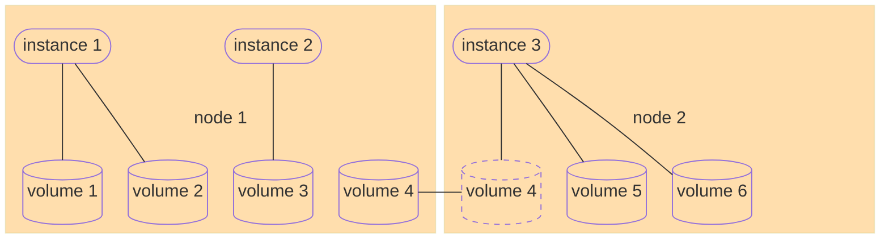

# OpenStack cloud architecture for local storage in cinder

* `cinder-volume` service on every hypervisor
  * security: DB credentials on every hypervisor
* volumes need to move transparently between hypervisors

---

[prev](001-motivation.md) [TOC](000-toc.md) [next](003-dm-clone.md)
