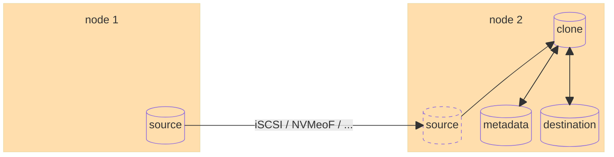

# Device-mapper clone target

* multi-attachment for live-migration?
* failure modes
  * failure of source node + network partitions
    * IO errors => FS read-only, data unavailable
    * dm-clone retries indefinitly => recoverable
  * failure of destination node
    * data unavailable until recovery
    * driver should reconstruct the dm-clone target

---

[prev](002-cloud-architecture) [TOC](000-toc.md) [next](004-dm-clone-2.md)
