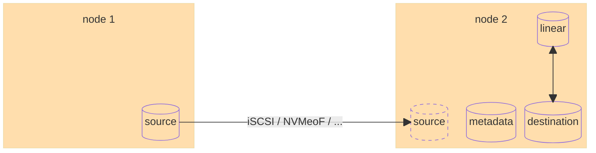

# Replacing dm-clone with dm-linear

```mermaid
block-beta
columns 3
block:src_node["node 1\n\n\n\n\n\n\n\n"]:1
  columns 3
  space:3
  space:3
  space:2 src_a[("source")]
end
space:1
block:dst_node["node 2\n\n\n\n\n\n\n\n"]:1
  columns 3
  space:2
  clone[("linear")]:1
  space:3
  src[("source")]
  md[("metadata")]
  dst[("destination")]
  dst <--> clone
  clone --> dst
end
src_a --"iSCSI / NVMeoF / ..."--> src
classDef remote stroke-dasharray: 5 5;
classDef node fill:#ffdead;
class src remote
class src_nodel, dst_node node
```

---

[prev](003-dm-clone.md) [TOC](000-toc.md) [next](005-driver-concept.md)
