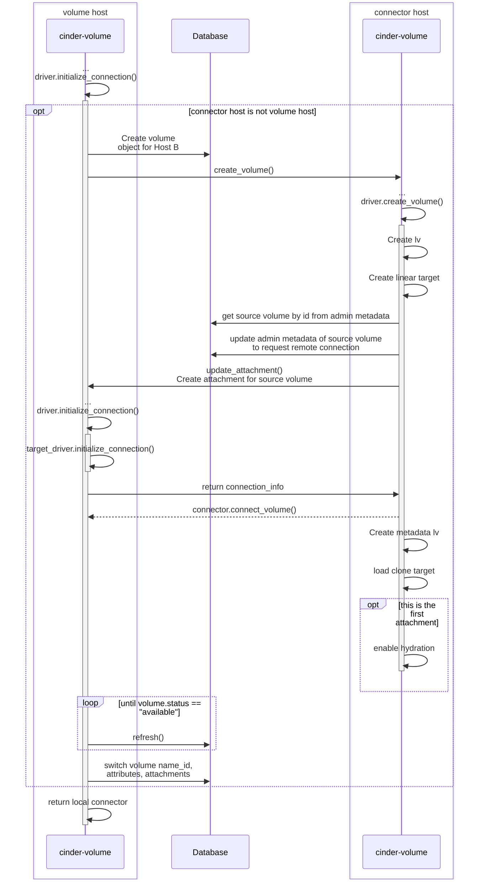

# Driver concept

## Initialize Connection

* Return remote connector if requested through volume admin metadata
  * use configured target driver
  *  e.g. connecting the source of a clone target, host-assisted volume migration, backup, ...
* Return local connector if connector indicates connection from same host as volume
* Transfer volume to destination and return a local connector

---

[prev](005-driver-concept.md) [TOC](000-toc.md) [next](007-driver-concept-term-conn.md)
